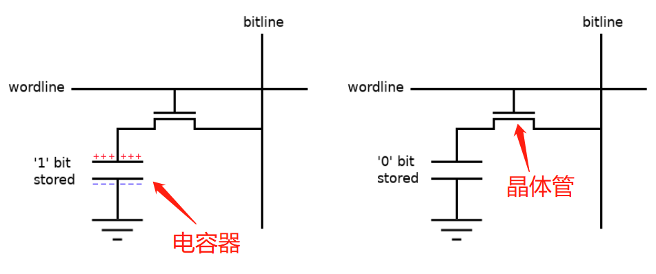

# DRAM工作原理

DRAM主要通过一个晶体管加一个电容器实现一个bit数据的存储。其中晶体管主要作为开关存在，而电容器则是通过存储电荷来改变与bitline之间的电压差距，并通过感测放大器放大电压差距并转换为逻辑电平。晶体管与电容器的组合结构如下图中所示。

>  晶体管由半导体组成，基于输入的电流或电压，改变输出端的阻抗，从而控制通过输出端的电流，因此晶体管可以作为电流开关。

当要将bit 1写入电容器时，wordline变高，晶体管作为开关切换，将bitline与电容器相连接。此时，如果电容器内有电荷，则两端电压相同，维持不变；反之，bitline端电压高于电容器端，由于电压差使得电容器处于充电状态（即电容器存储电荷）。写入bit 0情况相似。

同样的，当要从一个电容器中读取一个bit数据时，wordline变高，bitline与电容器相连接，此时bitline未处于通电情况，通过电容器与bitline之间的电压差实现０或１的逻辑电平。

此外，由于存储在每个电容器上的电荷太小，以至于无法直接读取区分，所以需要感测放大器将获取到的电荷放大然后输出相应的逻辑电平。

从位线读取的行为迫使电荷从电容器中流出。因此，在DRAM中，读取具有破坏性。为了解决这个问题，进行了一种称为预充电的操作，将从位线读取的值放回电容器中。同样有问题的是，电容器会随时间泄漏电荷。因此，为了保持存储在存储器中的数据，必须定期刷新电容器。刷新就像读取一样，可以确保数据永不丢失。这就是DRAM从中获得“动态”绰号的地方-DRAM单元上的电荷每隔一段时间就会动态刷新一次。与此形成对比的是SRAM（静态RAM），该SRAM保持其状态而无需刷新。