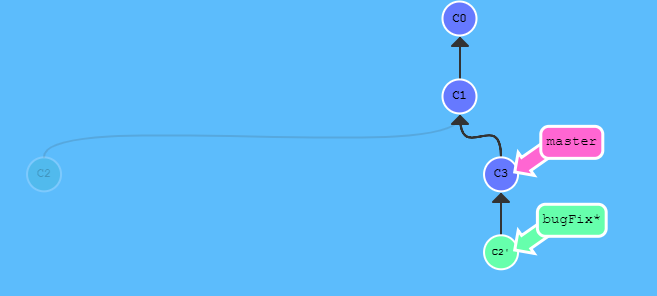
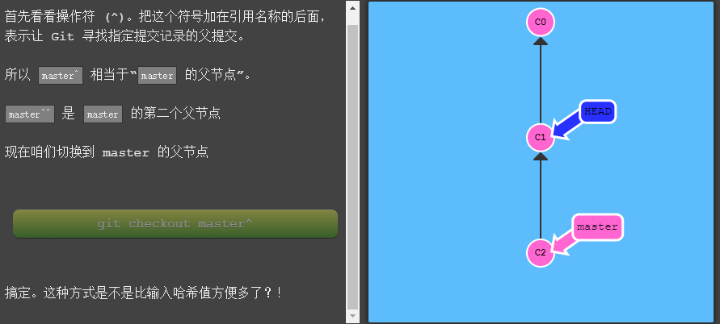
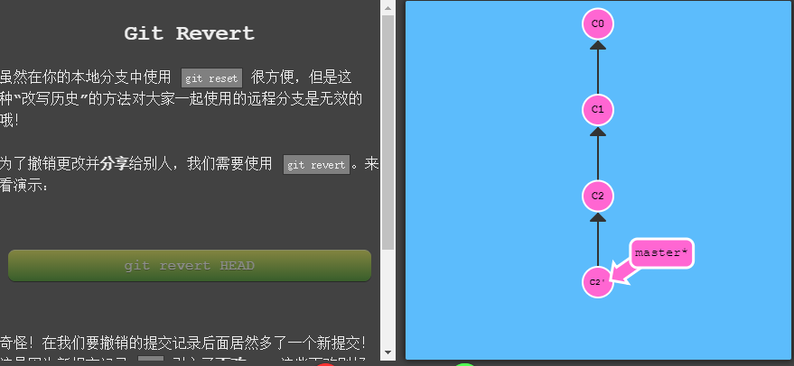
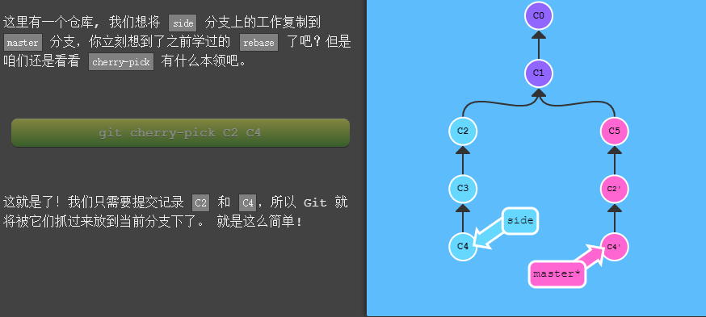

### Git学习记录

#### git 提交记录与分支

1. git commit	提交记录

2. git branch <branchname> 在当前提交记录上新增分支

3. git checkout <branchname> 切换分支

4. git checkout -b <branchname> 新建分支并切换到该分支

5. git merge <branchname> 将branchname分支跟当前分支合并在一起

6. git rebase <branchname> 将当前分支与该分支不同的提交记录全部顺序提交到该分支下

   

#### git 移动

HEAD通常情况下是指向分支名，并随分支提交记录前进

1. git checkout <提交记录哈希值> 从分支名中分离出HEAD并指向某一具体记录

2. git checkout <branchname>^ | git checkout <branchname>~<num> | git checkout HEAD(^, ~<num>)    将Head向相对记录移动

   

3. git branch -f <branchname> HEAD~3 将master分支强制指向HEAD的第3次提交

4. git reset HEAD~1 将分支记录回退到HEAD~1处 （**适用于本地仓库**）

5. git revert HEAD 撤销当前分支记录 (**可用于远程仓库**)

   

6. git cherry-pick <提交号> 将某一分支下的记录提交到当前分支下，但不印象该分支

   

7. 交互式rebase指的是使用带参数--interactive的rebase命令，简写为-i，git rebase -i HEAD~4
8. git tag <tagname> <记录> 命名标签并将该标签标记到记录上

### 远程仓库

#### Push & Pull

1. 远程分支只有当远程仓库更新时才会变动
2. git clone 从远程仓库clone下来
3. git fetch 从远程仓库下载本地仓库中缺失的提交记录，更新远程分支指针（如o/master）**所有分支的记录**
4. git pull 从远程仓库下载本地仓库中缺失的提交记录，并合并本地分支和远程分支
5. git push 将本地记录上传到指定的远程仓库，并在远程仓库上合并你的新提交记录，同时本地远程分支也会更新
6. git pull --rebase == git fetch + git rebase （当远程分支有新提交记录时）
7. git checkout -b <分支名> <远程分支名> 创建一个本地分支，跟踪远程分支
8. git branch -u <远程分支> <分支名> 设置远程追踪分支，如果无分支名，则是当前分支（**分支必须已经存在**)
9. git push origin <本地分支名> 
10. git push origin <source>:<destination> 
11. git fetch origin <远程分支名> 不会更新本地分支
12. git fetch origin <source>:<destination> 跟push相反，会自动创建本地分支，不会更新本地远程分支的位置